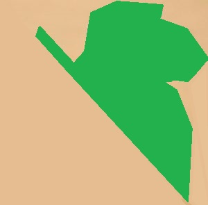

<div id="top"></div>
<!--
*** Thanks for checking out the Best-README-Template. If you have a suggestion
*** that would make this better, please fork the repo and create a pull request
*** or simply open an issue with the tag "enhancement".
*** Don't forget to give the project a star!
*** Thanks again! Now go create something AMAZING! :D
-->


<!-- PROJECT SHIELDS -->
<!--
*** I'm using markdown "reference style" links for readability.
*** Reference links are enclosed in brackets [ ] instead of parentheses ( ).
*** See the bottom of this document for the declaration of the reference variables
*** for contributors-url, forks-url, etc. This is an optional, concise syntax you may use.
*** https://www.markdownguide.org/basic-syntax/#reference-style-links
-->

[![Contributors][contributors-shield]][contributors-url]
[![Forks][forks-shield]][forks-url]
[![Stargazers][stars-shield]][stars-url]
[![Issues][issues-shield]][issues-url]
[![MIT License][license-shield]][license-url]
[![LinkedIn][linkedin-shield]][linkedin-url]


<!-- PROJECT LOGO -->
<br />
<div align="center">
  <a href="https://github.com/joralgra/wordleBOT">
    
  </a>

<h3 align="center">Wordle Assistant</h3>

  <p align="center">
    Console application that follows your game state and provides options. It saves time for finding words.
    Currently only working for standard daily SPANISH challenges.
    <br />
    <a href="https://github.com/joralgra/wordleBOT"><strong>Explore the docs »</strong></a>
    <br />
    <br />
    <a href="https://github.com/joralgra/wordleBOT">View Demo</a>
    ·
    <a href="https://github.com/joralgra/wordleBOT/issues">Report Bug</a>
    ·
    <a href="https://github.com/joralgra/wordleBOT/issues">Request Feature</a>
  </p>
</div>


<!-- TABLE OF CONTENTS -->
<details>
  <summary>Table of Contents</summary>
  <ol>
    <li>
      <a href="#about-the-project">About The Project</a>
      <ul>
        <li><a href="#built-with">Built With</a></li>
      </ul>
    </li>
    <li>
      <a href="#getting-started">Getting Started</a>
      <ul>
        <li><a href="#prerequisites">Prerequisites</a></li>
        <li><a href="#installation">Installation</a></li>
      </ul>
    </li>
    <li><a href="#usage">Usage</a></li>
    <li><a href="#roadmap">Roadmap</a></li>
    <li><a href="#contributing">Contributing</a></li>
    <li><a href="#license">License</a></li>
    <li><a href="#contact">Contact</a></li>
    <li><a href="#acknowledgments">Acknowledgments</a></li>
  </ol>
</details>


<!-- ABOUT THE PROJECT -->
## About The Project

[![Product Name Screen Shot][product-screenshot]](https://example.com)

Allows you to introduce a string with the feedback of the game. 
Then creates a state that filters all the non-available words and shows you the alternatives to introduce in the next place.

**WIP** Prioritizes the possible word options with a Levenshtein distance to any available word. 
Then makes the introduced word more likely to be close to the final word (if there are many options)


<p align="right">(<a href="#top">back to top</a>)</p>


### Built With

* [Python](https://www.python.org/)


<p align="right">(<a href="#top">back to top</a>)</p>


<!-- GETTING STARTED -->
## Getting Started

This is an example of how you may give instructions on setting up your project locally.
To get a local copy up and running follow these simple example steps.

### Prerequisites

**WIP**
Tested with Python 3.9 
* pips as current dependencies
  ```python
    import re
    import tkinter as tk
    import json
  ```

[comment]: <> (### Installation)

[comment]: <> (1. Get a free API Key at [https://example.com]&#40;https://example.com&#41;)

[comment]: <> (2. Clone the repo)

[comment]: <> (   ```sh)

[comment]: <> (   git clone https://github.com/joralgra/wordleBOT.git)

[comment]: <> (   ```)

[comment]: <> (3. Install NPM packages)

[comment]: <> (   ```sh)

[comment]: <> (   npm install)

[comment]: <> (   ```)

[comment]: <> (4. Enter your API in `config.js`)

[comment]: <> (   ```js)

[comment]: <> (   const API_KEY = 'ENTER YOUR API';)

[comment]: <> (   ```)

[comment]: <> (<p align="right">&#40;<a href="#top">back to top</a>&#41;</p>)


<!-- USAGE EXAMPLES -->
## Usage

Execute main.py to start the console application.

Introduce a wildcard for each character of the word:

  **-a** --> States that the 'a' was GREY at that position. (The final words doesn't have 'a')
  
  **!a** --> States that the 'a' was GREEN at that position. (The final words has 'a' at that specific position)
  
  **?a** --> States that the 'a' was YELLOW at that position. (The final words has 'a' at other position)

### p.e
The input string **-a?m!i-g!o**

- States that the final word doesn't have 'a' or 'g' (GREYS). 
- States that the final word has 'i' and 'o' (GREENS) are in his correct place. 
- States that the final word has 'm' but is in other position, not in the second character (YELLOWS).

_For more examples, please refer to the [Documentation](https://example.com)_

<p align="right">(<a href="#top">back to top</a>)</p>


<!-- ROADMAP -->
## Roadmap

- [ ] Levenshtein distance for base cases
- [ ] FIX repeated characters on the same word.
- [ ] Provide base words for the game first word iteration.
  - [ ] Ranking of best 10 words
  - [ ] Feeling lucky (Providing one complete random word)
  - [ ] Need a challenge (Providing one of the worst 10% words)
- [ ] Add ENGLISH! (data that needs to share the /data/spanish.txt format)
- [ ] Improved help, make it visual.
- [ ] Game state visualization improvement
- [ ] Game state CRUD
- [ ] Add other Wordle game modes
- [ ] Get game state from the wordle webpage.
- [ ] Game theory IA training ... Win % for each turn

See the [open issues](https://github.com/joralgra/wordleBOT/issues) for a full list of proposed features (and known issues).

<p align="right">(<a href="#top">back to top</a>)</p>


<!-- CONTRIBUTING -->
## Contributing

Contributions are what make the open source community such an amazing place to learn, inspire, and create. Any contributions you make are **greatly appreciated**.

If you have a suggestion that would make this better, please fork the repo and create a pull request. You can also simply open an issue with the tag "enhancement".
Don't forget to give the project a star! Thanks again!

1. Fork the Project
2. Create your Feature Branch (`git checkout -b feature/AmazingFeature`)
3. Commit your Changes (`git commit -m 'Add some AmazingFeature'`)
4. Push to the Branch (`git push origin feature/AmazingFeature`)
5. Open a Pull Request

<p align="right">(<a href="#top">back to top</a>)</p>


<!-- LICENSE -->
## License

Distributed under the MIT License. See `LICENSE` file for more information.

<p align="right">(<a href="#top">back to top</a>)</p>


<!-- CONTACT -->
## Contact

Joralgra - [@replica_SP](https://twitter.com/replica_SP) - joralgra.dev@gmail.com

Project Link: [https://github.com/joralgra/wordleBOT](https://github.com/joralgra/wordleBOT)

<p align="right">(<a href="#top">back to top</a>)</p>


[comment]: <> (<!-- ACKNOWLEDGMENTS -->)

[comment]: <> (## Acknowledgments)

[comment]: <> (* []&#40;&#41;)

[comment]: <> (* []&#40;&#41;)

[comment]: <> (* []&#40;&#41;)

[comment]: <> (<p align="right">&#40;<a href="#top">back to top</a>&#41;</p>)


<!-- MARKDOWN LINKS & IMAGES -->
<!-- https://www.markdownguide.org/basic-syntax/#reference-style-links -->
[contributors-shield]: https://img.shields.io/github/contributors/joralgra/wordleBOT.svg?style=for-the-badge
[contributors-url]: https://github.com/joralgra/wordleBOT/graphs/contributors
[forks-shield]: https://img.shields.io/github/forks/joralgra/wordleBOT.svg?style=for-the-badge
[forks-url]: https://github.com/joralgra/wordleBOT/network/members
[stars-shield]: https://img.shields.io/github/stars/joralgra/wordleBOT.svg?style=for-the-badge
[stars-url]: https://github.com/joralgra/wordleBOT/stargazers
[issues-shield]: https://img.shields.io/github/issues/joralgra/wordleBOT.svg?style=for-the-badge
[issues-url]: https://github.com/joralgra/wordleBOT/issues
[license-shield]: https://img.shields.io/github/license/joralgra/wordleBOT.svg?style=for-the-badge
[license-url]: https://github.com/joralgra/wordleBOT/blob/master/LICENSE
[linkedin-shield]: https://img.shields.io/badge/-LinkedIn-black.svg?style=for-the-badge&logo=linkedin&colorB=555
[linkedin-url]: https://linkedin.com/in/jordi-almendros-granero
[product-screenshot]: images/screenshot.png